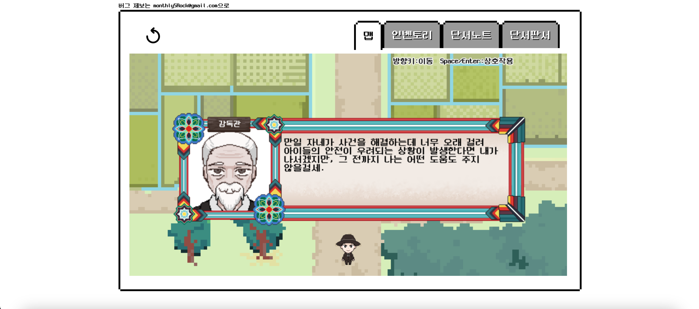
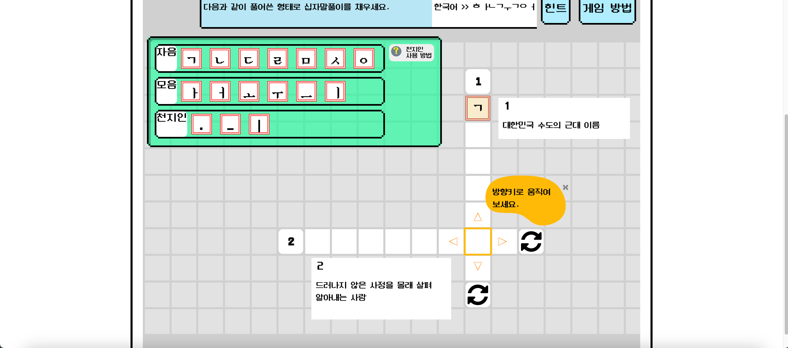

I started '경성 탐정' (Kyungsung Detective) as a small group project in 2021 in the school coding club. We started as a group of 5 members, 3 programmers (including me), 1 graphics artist, and 1 story writer. Honestly that was the most people we ever had in our team.

Since then, a lot of things changed over time with the original members leaving the team and new members joining and leaving afterward. The project was "whacky", to say the least. However, Kyungsung Detective went through thin and thick, and eventually made it to the point that it be planned to be officially released in Q1 of 2024. We even worked on it through the whole 2023 and even released the beta version in May.

As the title suggests, we couldn't make it to the official release. In fact, Kyungsung Detective has stopped further official development after the last update of the beta version in Februray 2024. The team also decided to split up too, leaving me as the sole member.

In this post, I will talk about Kyungsung Detective and why we failed at officially launching the game.

---

# '경성 탐정' (Kyungsung Detective) Overture

> you can check out the beta version of '경성 탐정' (Kyungsung Detective)
> [here](https://kyungsung-detective-beta.vercel.app).
>
> it only works in PC and only supports Korean

Kyungsung Detective is a web-based detective puzzle game. It is composed of a Vue backbone running a 2D RPG style map made in phaser3.

The story follows the journey of Sami, the protagonist, who decides to become a private detective after her mother's loss. The game takes place in an alternate history of 1930s, where Korea accepts private detectives as official law enforcement figures besides the police.

We also made additional tweaks to the historical background. In the actual 1930s Korea was colonized by Japan, and a protagonist who works in law enforcement at that time era could bring up many *moral dillemas*. Sure, the story could focus on those moral dillemas, like the popular kdrama, '각시탈' (Gaksital) or Raju from the popular Indian film, 'RRR'. But that wasn't the point of the game. So to focus the story more on the detective side while being guilt-free making them (and for the players too), we also set that Korea opened its border to the western world in a voluntary and peaceful way and added additional settings to make it to make sense.

So Kyungsung Detective became a game about being a detective solving cases in a time when foreign ideas disrupt the old customs. Most of the parts are similar to other detective games; looking around and talking to suspects for clues, and proving your accusation using them.

The most unique part of Kyungsung Detective that differentiates with other games is the puzzle. In Kyungsung Detective, you need to solve puzzles to draw further information from important clues.

The puzzle in Kyungsung Detective is an unique crossword-theme puzzle that uses the Korean alphabets. You need to fill out the rows or columns with the Korean alphabet in a dismembered spelling of the word with all the consonants and the vowels spread out.
For example, the work '탐정' should be spelled like 'ㅌ ㅏ ㅁ ㅈ ㅓ ㅇ'.

Although it may seem simple and 'too easy', this puzzle has its own twists and turns. Since you can create new consonants and vowels using the special components, '.', '_', and '\|', and you need to merge two tiles to do so, **the number of tiles doesn't always directly tells you the alphabets needed to make the word**. Also, Korean letters have an optional third consonant which can sometimes be a set of *two consonants*, so it becomes tricky to guess where the letter ends.

## Why Did We Fail?
Kyungsung Detective was made to be published in a rather unconventional way. It was meant to be published in a form of newletter attached with a link to a new stage (aka. new case) every month. This is also the reason it was created as a web-based game.

To make this possible, we needed a system that made monthly developments of new cases fast and efficient. Using wave function collapse to auto-generate maps and NPCs was one of them I had in mind. We also needed a better organized scripting system than creating JSON files. Since phaser3 was too liminal to do the task, the official version of the game needed a proper game engine like Unity or Godot.

At the time, I was already busy working with iterating features based on user feedbacks in updates of the beta version. So we got a new Godot programmer for the team. However the new programmer dropped out of the project due to personal issues.

Without the proper system it was impossible to release the game. There is the option of me picking up the work or getting another programmer, but either way we couldn't make it to the planned deadline. And delay in release meant delay in profit (even the smallest profit is still profit!) which meant the team's unstability would also be extended.

Even the other team members weren't sure if they could continue working for the project after Q1 of 2024. So not only would the development take longer, I would also lose my team members during the process, which again makes development much difficult, and on and on. It was clear continuing development was a huge loss with no promising breakthrough.

After some discussion, the team decided to stop further official development after the last update of the beta version and to split up.

---

# Conclusion

So, we failed for one obvious reason, bad luck. I'm kidding. Besides being unlucky, the project wasn't perfect and there are mistakes I wish not to repeat in the future.

## Be Reasonable with Resources

The first problem was that a detective game wasn't the best genre for a small team. If Kyungsung detective was officially released, we had to come up with new cases every month. And new maps, NPCs, and scripts accompanied with it. Without a partially automated system that leverages the development process, 1-2 graphics artists wouldn't be enough, even working full-time.

## Go for a Simpler Structure

Godot supports WebGL export. But it can't be integrated in web-frameworks like phaser3 does. The most efficient way we found out to run the exported WebGL was to run the WebGL in a seperate server, and use an iframe with the address of the server to bring it to the Vue backbone.

The game already has a complicated system to link events on the map to the rest of the game in the Vue backbone made with pinia. These include the puzzle and the cluenote which are not only crucial to the game, but also require intricate links between the events on the map for seamless game play.

Anyone with some experience in game development would have noticed how absurd this design choice was. If we used iframes just as we planned, we needed to use APIs to communicate with the WebGL server, and adding that layer of complexity to an already complicated system would have been a **NIGHTMARE**.

Some would say we had to move all our game to Godot when we had a Godot programmer and we had the chance. That is 100% right.

However we couldn't and it was because we relied heavily on Vue for the game's UI. If we moved the game entirely to Godot, we had to recreate all the UI components made with CSS into image files. Not to mention I had to recreate the whole puzzle too. Translating the engine script from JS to GDScript wasn't a big problem. But *creating a template that works like the table element in Godot*? I don't even dare.

## Use the Right Tools

Yes. Vue is not the best to make a game with. Even if I don't regret the choice and actually had an interesting experience with it, it was a choice that costed afterwards nonetheless.

Now I have some general rules of thumb to follow for my next project.

- Since I am the only member of my team now, *no trying out new methods*
- That means to **stick to traditional publication methods**
- While **making the game simple**
- And **using proper tools** (I will be using Godot)

I am sad Kyungsung Detective didn't turned out as I planned, but I am also excited to start a fresh new project. In my next post, I will talk about the ideas and sketches about my new project.

`See you next time!`