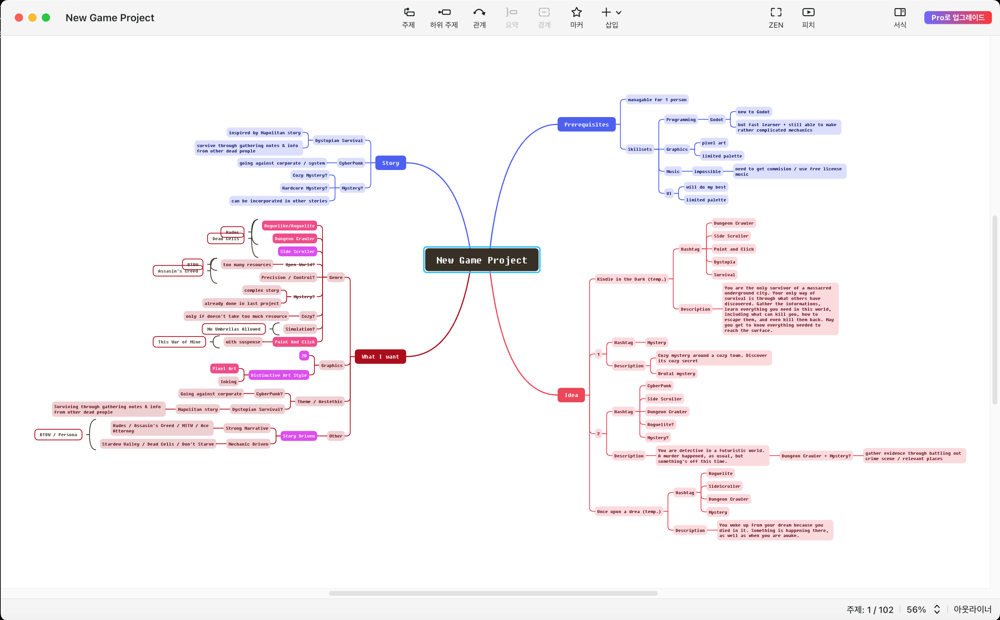
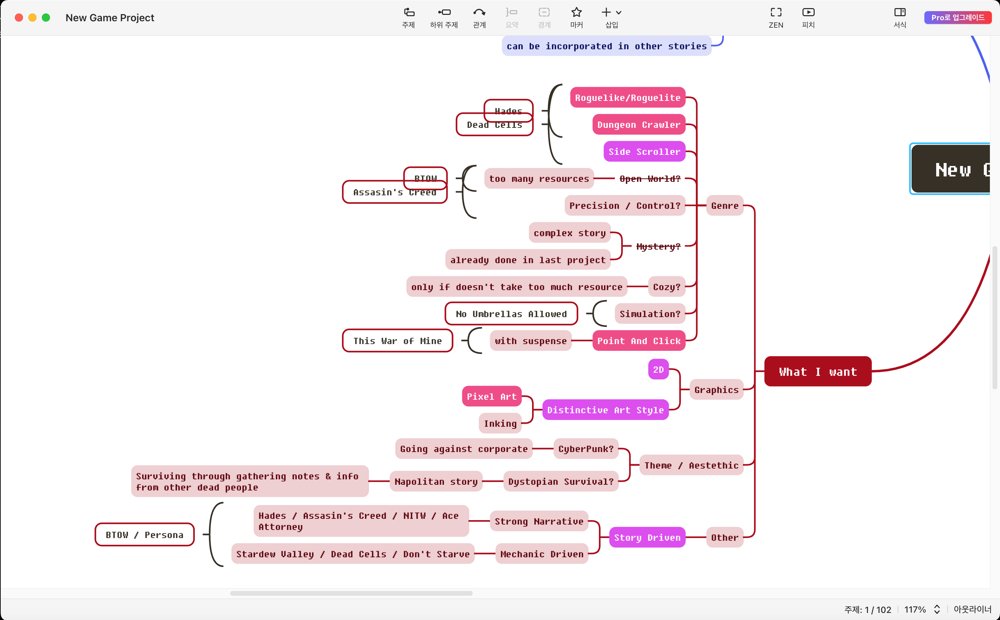
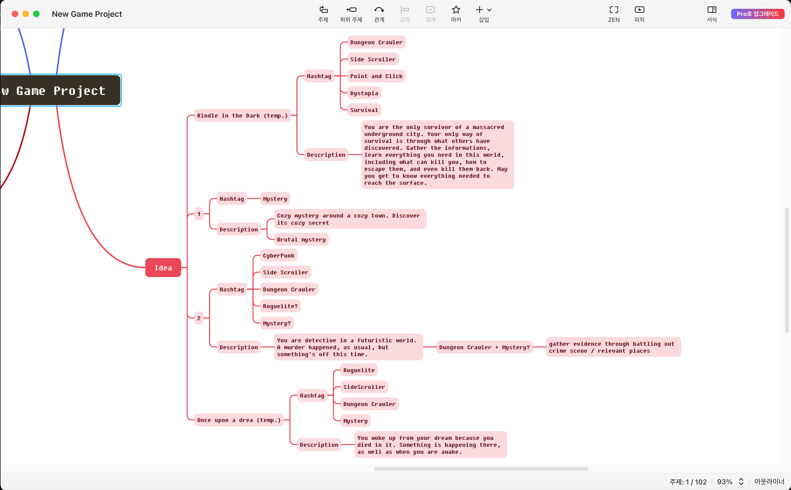

This week's been my first week of my new project. Nothing much has been done honestly, mostly just deciding what game to make. My previous game was a detective puzzle game and this time I wanted to make something different.

# Brainstorming

So I had a brief brainstorming session for my next game. This is the overview of the whole result.

## What do I want?

Making games take a long time. And I can't work on something I dislike for that long. To make the process enjoyable I started with listing what I wanted in my game.

### Story-Driven

I soon realized the most important thing about my game was that **it had to be packed with stories**.

I always loved games that had some sort of story, and my favorite games, unironically, were also those that involved stories. Whether it has a strong narrative, like *'Hades', 'Assasin's Creed 2', 'Night in the Woods', and 'Ace Attorney'*, or shows the story more subtly through game mechanics, like *'Stardew Valley', 'Dead Cells', and 'Don't Starve'*, I loved games that showed its own world and lore.

And that was what had to be in my game too. I wanted to make `a game that has a strong story and revolves around it.` I haven't yet decided **how** to show the story, and how strong the narrative should be, but I think that would depend on the game design as it becomes more concrete.

### Genres

Next I thought of genres, a general picture of what my game would look like.

I was into 'Hades' and 'Dead Cells' so `Roguelite` and `Dungeon Crawler` first came to mind. Because of its simplicity, a `Side Scroller` seemed like a better option than an isometric view.

I also liked Open-World games like 'Breath of the Wild' and 'Assasin's Creed 2' but that required too much resource for a single developer so I gave a hard pass on that one. Cozy games also weren't the best candidate for the same reason, since they usually required an extensive set of resource too.

Then I remembered how much I liked 'This War of Mine', and the suspense it gave through a simple Point-and-Click mechanic. That was when I came up with the idea of combining `Point-and-Click` with `Roguelite` and `Dungeon Crawler` from earlier; **a `Point-and-Click` with fast pace action and boss battle**. The idea seemed fun and unique so I decided to go for it.

### Themes

For the theme to go along with the genre, I first came up with a CyberPunk theme. Not only was I a huge fan of CyperPunk but it also seemed to match with the fast pace of the game. However I couldn't come up with something more specific, especially that matches with the 'boss battle' part.

Since 'This War of Mine' is a survival game, a dystopian survival also seemed suitable. I combined it with Napolitan Stories I once read that were a set of survival rules in an apocalytic setting.

> Napolitan Story
>
> A Napolitan Story is a sub-genre of horror that started as a short internet post and became popular in Korea and Japan. It's called Napolitan Story because the first story was about a restaurant in the woods that served napolitan pasta, a pasta dish made of ketchup.
>
> The main idea of this kind of story is to intrigue horror by subtle implications. The reader gets a good guess of something horrible happening but that something is not explicitly described in the story.

So just like the Napolitan Story, I thought of **a protagonist who has no idea of the world around them and has to collect survival guides to figure things out**. This quickly evolved into a story where an apocalypse happens and humanity flees underground from the threats that endanger them. The protagonist wakes up in one of the underground cities only to find out everybody else is killed and has no memory left. The only thing that can keep them alive is the knowledge left by the dead. ***They now need to discover rules to find ways, identify threats, avoid them, and make it to the surface***.

This idea fitted perfectly with the whole fast-paced `Point-and-Click` `Dungeon Crawler`. Even boss battles could be added as battling with the *dangerous beings* that massacred the city.

---

I came up with a few more ideas but nothing resonated like this one. Besides the rest was mostly detective game ideas, *again*!

Inertia is really something...

I named my game 'Kindle in the Dark', as the survival guides gained through the journey acts like small candle lights in the dark, but the name can change any time during development. For now it will be 'Kindle in the Dark', kitd for short.

The next post would be about setting up my project in Godot. `See you next time!`