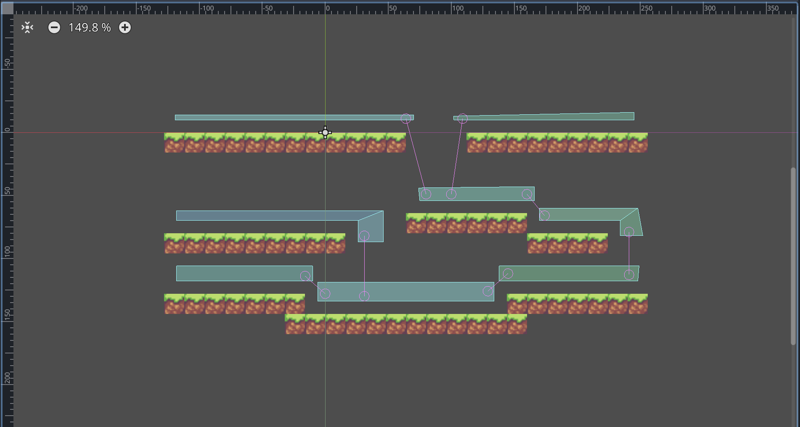
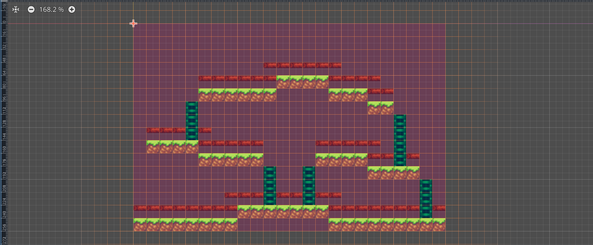
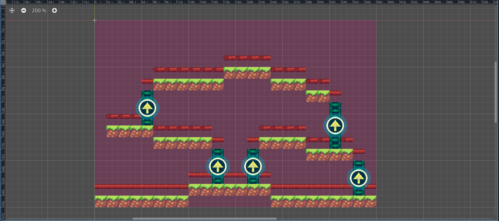

I needed a navigation system for my game. Specifically, with these following requisites.

> - It needs to get the exact destination tile from the mouse-click position, while also considering the fact that the map has different levels.
> - It then needs to find the fastest path from the current position to the destination tile.
> - If an icon is clicked, it needs to get the destination tile according to the direction of the player's path.

This took me a lot of time. Mostly it was because I wasn't used to Godot, and I tried a number of different options before finding the best one.

# Creating My Own Path Finding Algorithm

At first, I thought of creating my own path finding.

Using vertically long tilesets to create the map would easily get the destination tile from the mouse-click. Then I could create an algorithm that gets the fastet path by searching surrounding tiles untill it reaches the destination tile.

There were a lot of resources available for path finding algorithms. Also, it would have been a great chance to learn basic algorithms.

## Limits

Modifying the algorithm to limit vertical movements to certain points was a challenge.

Moreover, because of the unconventional ratio of the tiles, `creating assets that fit within the tiles was difficult.` It also **limited the map design and made very little room to introducing new types of tiles in the future.**

# Using the Godot NavigationRegion2D

That was when I learned about Godot's **NavigationRegion2D.**

NavigationRegion2D is a node that **generates the navigation area that can be accessed by an object with the NavigationAgent2D node.** The best part is that `it can automatically exclude the tiles of the TileMap!`

All you have to do is
> 1. Set the TileMap as the child node of the NavigationRegion2D
> 2. Set the layer with collision tiles as the top layer
> 3. Create a NavigationPolygon that covers the map, and click 'Bake NavigationPolygon' button on the top right side

*And boom!*



*A navigation area that doesn't overlap the TileMap!*

You can also use the **NavigationLink2D** node to easily connect distant navigation areas. I used it to connect navigation areas that were on different levels.

## Limits

Even though NavigationRegion2D, and NavigationAgent2D drastically reduced the time and effort, there were a couple of critical problems.

The first one was that the player would `float when the path didn't stick to the ground.`


Another problem was that it was `difficult to create consistent navigation areas for each level.` Sometimes when the distance between two adjacent tiles were too close, the navigation area would overlap between the empty space between the two tiles.

# Using the Godot AstarGrid2D

After some research, I learned about another navigation node from Godot.

It was the **AstarGrid2D**, which is **a specialized navigation node for 2D grids.** By registering the region and the cell size, it automatically creates points that can be used for path finding.

If you want to exclude certain points from path finding, like setting obstacles, you can set the points to be solid.

In my case, I created a navigation layer that shows the navigation points, and set the rest of the tiles solid by going through each tile of the TileMap at the beginning.



```ts
for x in tilemap_size.x:
    for y in tilemap_size.y:
        var coord = Vector2i(x,y)
        var tile_navigatable = get_cell_tile_data(1, coord) # get navigation layer tile
        if !tile_navigatable:
            # disable path-finding
            astar.set_point_solid(coord)
```

You can also adjust the path finding options. For my game, I set the computation to get a manhattan path, and allowed diagonal movements.

```ts
astar.default_compute_heuristic = AStarGrid2D.HEURISTIC_MANHATTAN
astar.default_estimate_heuristic = AStarGrid2D.HEURISTIC_MANHATTAN
astar.diagonal_mode = AStarGrid2D.DIAGONAL_MODE_ALWAYS
astar.update()
```

## Converting the Mouse-Click Position to a Navigatable Position

When the player clicks on the map to move the character, they don't always click the *exact* spot they want.

Since the player has to stay on the ground, the navigation area is mostly a row of singular tiles right above the ground. No one should expect them to always precisely click on that small patch, especially when the navigation layer is expected to be invisible in the actual game.

**How do we get the player's intention in this map when they didn't clicked on the tiles from the navigation layer?**



- If the player clicked on an icon, the player either wants to move up or down a level.
    - If the position of the icon is higher than the current position, the player wants to move up a level.
    - If the position of the icon is lower than the current position, the player wants to move down a level.
- In other cases, the player intends to move to the closest ground beneath the mouse-click.

Based on these assumptions, I wrote the code that gets the intended navigation tile from the mouse-click position.

```ts
func _get_current_path(current_pos, target_pos) -> Array[Vector2i]:
	var current_coord = local_to_map(current_pos)
	var target_coord = local_to_map(target_pos)
	
	# check icon click
	var icon_click = check_icon_click(target_pos)
	# convert target_pos to closest navigation-tile position
	var tile_navigatable = get_cell_tile_data(1, target_coord)
	while !tile_navigatable:
		if icon_click:
			if current_coord.y > target_coord.y:
				# player move up
				target_coord.y -= 1
			else:
				# player move down
				target_coord.y += 1
		else:
			target_coord.y += 1
		tile_navigatable = get_cell_tile_data(1, target_coord)
		
	if target_coord.y != current_coord.y:
		# update navigation map
		update_astar(true, current_coord)
	
	
	var nav_pos = map_to_local(target_coord)
	var path = astar.get_id_path(
			local_to_map(current_pos),
			local_to_map(nav_pos)
		).slice(1)
		
	return path
```

The AstarGrid2D would then calculate the fastest path from the current position to the destination position.

## Adding Vertical Paths

When the destination position is in a different level from the current position, the navigation area should be updated to enable vertical movements in certain points.

```ts
if target_coord.y != current_coord.y:
    # update navigation map
    update_astar(true, current_coord)
```

In the TileMap, I created a layer for navigatable objects, mostly ladders to climb up and down levels in this case.


The points in the navigatable objects layers are solid by default, thus not navigatable.

When one of the icons are clicked or the destination is on a different level from the current position, **the TileMap un-solids these points, and the path is calculated with the updated navigation area.**

```ts
func update_astar(navigatable: bool, player_pos: Vector2):
	var tilemap_size = get_used_rect().end - get_used_rect().position
	for x in tilemap_size.x:
		for y in tilemap_size.y:
			var coord = Vector2i(x,y)
			if navigatable:
				# enable path-finding on navigatable cells
				if get_cell_tile_data(2, coord):
					astar.set_point_solid(coord, false)
			
			else:
				# disable path-finding on navigatable cells
				if get_cell_tile_data(2, coord) and not get_cell_tile_data(1, coord):
					# disable navigatable cells exclusively
					astar.set_point_solid(coord)
					
				# switch icon image according to player_pos
				get_tree().call_group("Icons", "switch_image", player_pos)
```

When the player reaches the destination, **the TileMap sets the navigatable points back to solid again.** Since there could be an overlap between the navigation point and the navigatable point, *the navigatable points are exclusively selected to prevent navigation points set to solid.*

The end result looks like this.


---

I also made the player script to follow the path and add physics to the movement, but the post would be too long if that was included. And, as there are some small adjustments left to make, I will discuss them all at once in my next post.

Creating the demo while learning Godot is taking more time than I expected, but I think the next post will be out faster, approximately in 2 weeks.

I hope that would be a start to shortening the whole blog-posting cycle. `See you next time!`